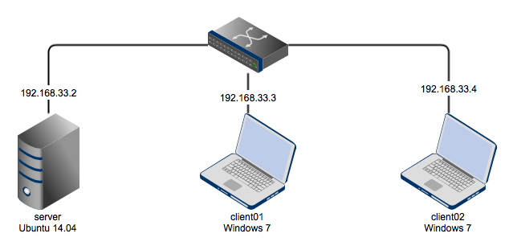

# chat-example

This is a simple [Node.js](http://nodejs.org) chat example based on [socket.io](http://socket.io).

## Chat server
Start the chat server with
```bash
npm install
node app.js
```

Open two browsers on port 8080

```bash
open http://localhost:8080
```

And type something into the chat text box.


## Vagrant
Additionally you can spin up three boxes with [Vagrant](http://vagrantup.com)



* server - start the Node.js chat server here
* client01 - a Windows 7 client with WireShark and Chrome Browser installed
* client02 - another Windows 7 client for further tests

Should work with VirtualBox. The VMware provider is not able to set the second network card automatically in the Windows guests.
If you do not have the base boxes, please head over to [Vagrant Cloud](http://vagrantcloud.com) and update the `vm.box` names in the `Vagrantfile` as needed.

```
vagrant up --provider=virtualbox
```

### server

```bash
vagrant ssh server
cd /vagrant
npm install
node app.js
```

### client01

* Open Chrome Browser with url http://192.168.33.2:8080
* Open the same page with Internet Explorer 8
```cmd
start http://192.168.33.2:8080
```

* Open WireShark for further investation.

### client02

* Try the same things here.
The second client box is to check whether messages are sent to both windows boxes or only to the box that is interested in messages.
